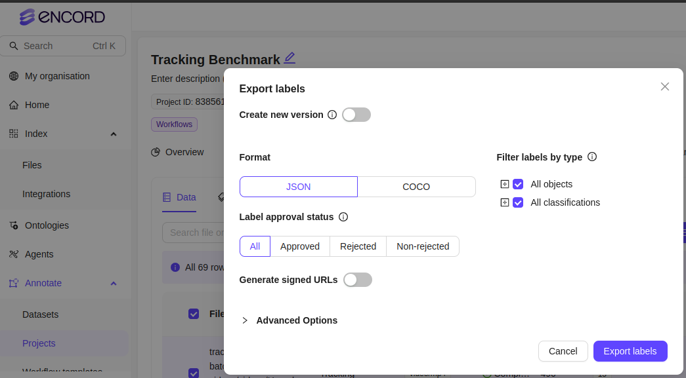

# ai-tracker

## Evaluation

### Before you start

1.  Go through the README section of the TrackEval [repository](https://github.com/LiveViewTech/TrackEval)
   1. Do not skip [this](https://github.com/LiveViewTech/TrackEval?tab=readme-ov-file#quickly-evaluate-on-supported-benchmarks) section
2. Download [this](https://omnomnom.vision.rwth-aachen.de/data/TrackEval/data.zip) file and extract it locally. 
   1. Familiarize yourself with the directory structure
3. Navigate to the `/path/to/extracted/track/data/directory/gt/mot_challenge` directory

### Preparing Ground Truth for Multi Object Tracking (MOT) evaluation:


1. Export Dataset from Encord and download the labels. Extract the downloaded `.zip` file to a directory.
    
2. Run the Encord to MOT dataset conversion script

    ```python3 convert_encord_to_MOT.py --encord-dir /path/to/extracted/encord/zip/directory --mot-gt-dir /path/to/extracted/track/data/directory/gt/mot_challenge --dataset-version your-dataset-version```

### Preparing Tracking metadata from Deepstream for Multi Object Tracking (MOT) evaluation:

1.  Run the Deepstream to MOT dataset conversion script

    ```python3 convert_deepstream_to_MOT.py --ds-benchmark-dir /path/to/deepstream/outputs/benchmarking/directory --mot-track-dir /path/to/extracted/track/data/directory/trackers/mot_challenge --dataset-version your-dataset-version --tracker-name your-tracker-name --tracker-version your-tracker-version```


### Run Tracker Evaluation for Multi Object Tracking (MOT) on LVT data:

1.  Run the Tracker Evaluation script for LVT data

    ```python3 run_mot_lvt.py --GT_FOLDER /path/to/extracted/track/data/directory/gt/mot_challenge --TRACKERS_FOLDER /home/sidd/Downloads/data/trackers/mot_challenge/ --BENCHMARK MOTLVT-your-dataset-version --SPLIT_TO_EVAL all```

